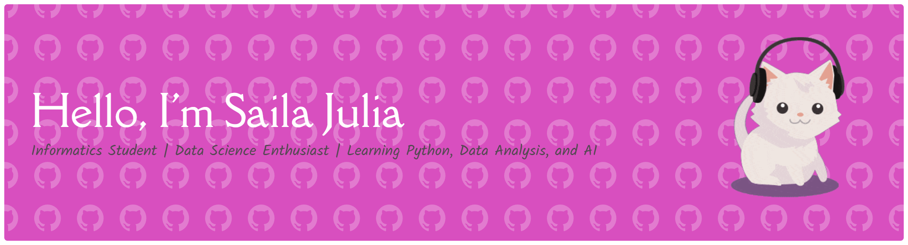

## 🌸Hello World! Welcome to Saila's GitHub 🌸

<div align="center">



</div>

---

## 💗 About Me

Hello! I'm Saila Julia, an Informatics Engineering student who is passionate about technology, data, and continuous learning.

🌷 Currently learning:

- Python Programming
- Data Analysis
- Machine Learning
- Git & GitHub

🎯 My goals:

- Build AI and Data Science projects
- Develop strong analytical skills
- Create a professional portfolio
- Grow as a future AI Engineer

---

## 🩷 Tech Stack

```text
🐍 Python
📊 Pandas
🔢 NumPy
📈 Matplotlib
🤖 Machine Learning
🌐 Git & GitHub
```
[](https://skillicons.dev)

---

## 🌸 Current Focus

```python
while learning:
    practice_python()
    build_projects()
    improve_skills()
```

---

## 💌 Connect With Me

📧 sailajulia.career@gmail.com

✨ Thanks for visiting my profile ✨

<!--
**sailajulia06/sailajulia06** is a ✨ _special_ ✨ repository because its `README.md` (this file) appears on your GitHub profile.

Here are some ideas to get you started:

- 🔭 I’m currently working on ...
- 🌱 I’m currently learning ...
- 👯 I’m looking to collaborate on ...
- 🤔 I’m looking for help with ...
- 💬 Ask me about ...
- 📫 How to reach me: ...
- 😄 Pronouns: ...
- ⚡ Fun fact: ...
-->
